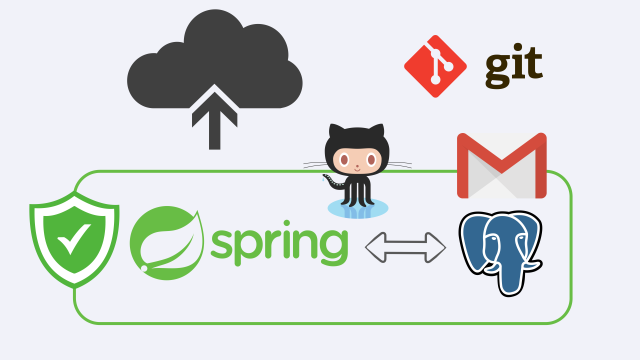
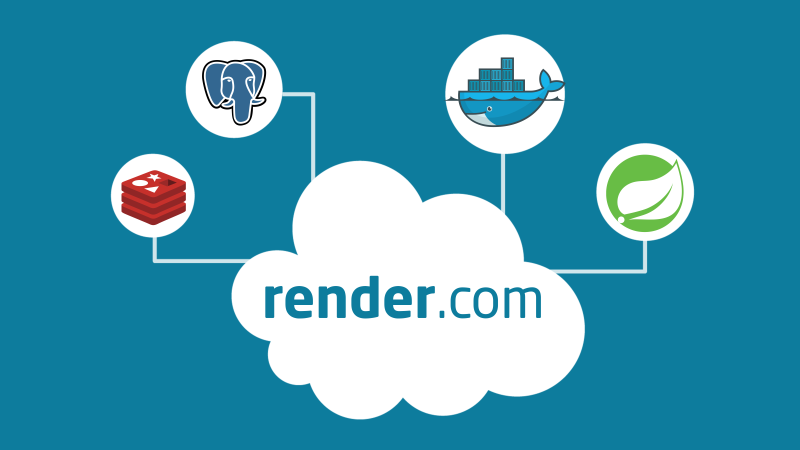

# Spring social 2 Cloud

Goal of the application is to create secured Spring Web application, that enables sign in via Oauth2 (github) and Oidc (google) providers.

PostgreSQL database is used to provide persistence.

Application is intended to be deployed to the cloud.

## Prerequisites

Prerequisites for developing / running app locally (__checked__ are mandatory)

- [x] java
- [x] docker
- [ ] git
- [ ] maven


## Running app locally

To start application locally, run following commands from the root of the project:

> 1. start required auxiliary services  
> **```docker compose up -d```**

> 2. run spring application using spring-boot runner  
> **```./mvnw spring-boot:run```**

> 3. access the app at:  
> ***http://localhost:8080***

---

To use Google and Github log in locally / in cloud, you'll have to register oauth2 applications with github (Oauth2) and google (Oidc).

You'll be given **CLIENT_ID** and **CLIENT_SECRET** which you'll need to place in your **environment variables**:

**GOOGLE**
* ```GOOGLE_CLIENT_ID```
* ```GOOGLE_CLIENT_SECRET```

**GITHUB**
* ```GITHUB_CLIENT_ID```
* ```GITHUB_CLIENT_SECRET```

Application will automatically pick up and use given values.


## Youtube tutorials
Series of Youtube tutorials where application is developed step by step accompanies the repository.

Youtube playlist:

[](https://youtube.com/playlist?list=PLLhgRnf2WBVQe1iPUuNZnMmlqK6vd_o59)


## Cloud providers

Various cloud providers will be used to deploy the app.

### Railway.app

[Railway.app](https://railway.app?referralCode=kanezi) is used as one of the cloud providers to deploy our app.

Railway exposes environment variables (`${{Postgres.*}}`) for database after provisioning Postgres instance.

Dynamic properties can be used to connect spring application to database:


| property | value                                                                                     |
|:---------|:------------------------------------------------------------------------------------------|
| DB_USER  | ```${{Postgres.PGUSER}}```                                                                |
| DB_PASS  | ```${{Postgres.PGPASSWORD}}```                                                            |
| DB_URL   | ```jdbc:postgresql://${{Postgres.PGHOST}}:${{Postgres.PGPORT}}/${{Postgres.PGDATABASE}}```|


### Render.com

[Render.com](https://render.com) can host docker images, postgres, redis and other services as explained in separate youtube tutorial:

[](https://youtu.be/WfjsGv5RoGE)

We use ```render.yaml```, infrastructure as code, configuration file in the root of our project to define services we need and how to connect them by using environment variables.


### clever-cloud.com

[clever-cloud.com](https://www.clever-cloud.com) can host java maven/gradle projects, docker images, postgres, redis, cellar (amazon aws s3 like) and other services.


We use *clever CLI* to provision, deploy and connect services and resources.

----

Example of using clever CLI to create ss2c (Spring Social 2 Cloud) docker type app, provisioning postgres database and linking it as an addon for our application.

1. create app

```clever create --type docker ss2c```

2. add postgres database add on

```clever addon create postgresql-addon db --link ss2c```

Once postgres addon has been added to our app, we can use environment variables clever cloud automatically provides to connect to database:

| property | value                                                                                     |
|:---------|:------------------------------------------------------------------------------------------|
| DB_USER  | ```${POSTGRESQL_ADDON_USER}```                                                                |
| DB_PASS  | ```${POSTGRESQL_ADDON_PASSWORD}```                                                            |
| DB_URL   | ```jdbc:postgresql://${POSTGRESQL_ADDON_HOST}:${POSTGRESQL_ADDON_PORT}/${POSTGRESQL_ADDON_DB}```|


We do that by setting up **clever_cloud** spring profile as environment variable in clever cloud application and using:
```spring.config.activate.on-profile=clever_cloud```
in *application.properties* to adjust datasource properties. 

3. deploy/restart app

```clever deploy```


#### github actions workflows

Project has 2 github actions workflows that showcase how to 
* create (*clever-cloud-create-docker-app.yml*) 
* and deploy (*clever-cloud-deploy-app.yml*) app from GitHub CI/CD settings.